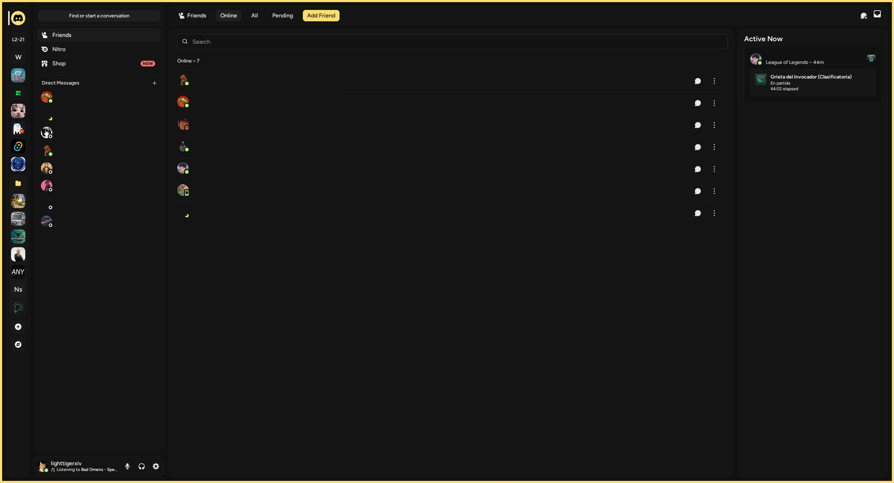

<div align="center">

  

  # Mono Code for Discord

  <div>
      
  </div>
</div>

# Thanks-To
This port was only possible with the great work of [Midnight](https://github.com/refact0r/midnight-discord) Theme. It uses this theme as a base.

# Install
You will need a discord mod client in order to install the theme. We recommend using [vencord](https://vencord.dev/).

After you installed the mod client you can add the theme by importing the theme URL:
```css
@import url("https://raw.githubusercontent.com/Mono-Code-Scheme/discord/refs/heads/main/themes/{accent}.css");
```
> Replace `{accent}` with the actual color. Ex: `yellow`, `neon-green`, `cyan`.


> [!NOTE]
> There's no light mode (lynx) version because the base theme only has dark mode and maintaining a discord theme is a very painful experience.


# Maintainers
🐈‍⬛ lighttigerXIV
